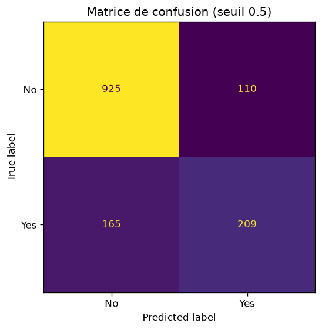

# Churn Classifier — Pipelines scikit-learn + MLflow + FastAPI

[](https://github.com/Niccoco78/mlops-project/actions/workflows/ci.yml)

Projet MLOps. On entraîne un classifieur de churn sur le jeu
**Telco Customer Churn**, avec un pipeline scikit-learn reproductible, un suivi
complet des expériences dans **MLflow** (paramètres, métriques, artefacts, Model
Registry), et on sert le modèle retenu derrière une API **FastAPI** conteneurisable.

Sujet : [`project/proposal.md`](https://github.com/Amokh2018/MLOps-Course-M2/blob/main/project/proposal.md)
du repo de cours.

## Démarrage rapide

```bash
git clone <ce-repo> && cd mlops-project
make init        # venv + dépendances (versions figées dans requirements.txt)
make data        # télécharge data/raw.csv (7 043 clients, 21 colonnes)
make train       # GridSearchCV + suivi MLflow + enregistrement dans le registre
make evaluate    # courbes ROC / PR, matrice de confusion, prédictions -> reports/
make test        # 19 tests
make ui          # interface MLflow : http://localhost:5000
make serve       # API : http://localhost:8000/docs
```

`make help` liste toutes les cibles. Sans `make` : chaque cible est une commande
Python à lancer **depuis la racine**, par exemple `python -m src.train --config configs/config.yaml`.

> Windows : les commandes fonctionnent dans Git Bash avec GNU make
> (`winget install ezwinports.make`). Le Makefile appelle le venv par son chemin,
> il n'y a pas d'`activate`.

## Structure

```
mlops-project/
├─ configs/config.yaml     # chemins, cible, colonnes, grille, CV, MLflow — tout ce qui varie
├─ src/
│  ├─ pipeline.py          # ColumnTransformer (imputation + scaling / one-hot) + modèle
│  ├─ train.py             # baseline ou GridSearchCV, autolog, signature, Model Registry
│  ├─ evaluate.py          # métriques finales, courbes, matrice de confusion, predictions.csv
│  ├─ predict.py           # inférence par lot sur un CSV
│  ├─ download_data.py     # récupère le jeu de données
│  └─ utils.py             # config, chargement, split, MLflow, métriques, graphiques
├─ service/
│  ├─ app.py               # API FastAPI (/health, /predict, /predict/batch)
│  └─ Dockerfile           # image de l'API
├─ tests/                  # pipeline, utilitaires, API
├─ reports/                # sorties de make evaluate (courbes versionnées, CSV non)
├─ data/                   # raw.csv, non versionné
├─ artifacts/              # model.joblib produit par make train, non versionné
├─ Makefile · requirements.txt · pyproject.toml · .env.example
```

## Le pipeline

Tout le prétraitement vit **dans** le `Pipeline`, donc il est appris sur le jeu
d'entraînement uniquement et rejoué à l'identique en inférence :

| Colonnes | Traitement |
|---|---|
| numériques (`tenure`, `MonthlyCharges`, `TotalCharges`) | `SimpleImputer(median)` → `StandardScaler` |
| catégorielles (16 colonnes) | `SimpleImputer(most_frequent)` → `OneHotEncoder(handle_unknown="ignore")` |
| modèle | `LogisticRegression` (ou `RandomForestClassifier`, au choix dans la config) |

Le split est stratifié (`test_size=0.2`, `random_state=42`) et partagé par
`train.py` et `evaluate.py` : les deux scripts voient exactement le même jeu de test.

Particularités du jeu Telco prises en charge dans `utils.coerce_features` :
`TotalCharges` est lu comme du texte (11 clients à `tenure = 0` ont un espace à la
place d'un montant) et devient `NaN` pour l'imputer ; `SeniorCitizen` (0/1) est
traité comme les autres catégorielles ; `customerID` est écarté ; la cible
`Churn` Yes/No devient 1/0.

## Résultats

Jeu de test : 1 409 clients, 26,5 % de churn.

| Run | ROC-AUC (CV) | ROC-AUC | PR-AUC | Accuracy | Précision | Rappel | F1 |
|---|---|---|---|---|---|---|---|
| `baseline-logreg` (défauts) | — | 0,842 | 0,634 | 0,806 | 0,657 | 0,559 | 0,604 |
| `gridsearch-logreg` (C=10, liblinear) | 0,846 | 0,841 | 0,628 | 0,805 | 0,655 | 0,559 | 0,603 |

La grille (`C` × `solver`, 6 combinaisons, 5 folds stratifiés) ne fait pas mieux
que les valeurs par défaut sur le jeu de test : la régression logistique est peu
sensible à `C` sur ces données, l'écart est du bruit. Le rappel de la classe
« churn » (0,56) est le point faible ; c'est le seuil de décision (0,5) qu'il
faudrait déplacer selon le coût d'un client perdu, pas le modèle.

<p align="center">
  
  
  
</p>

## MLflow

Backend `sqlite:///mlflow.db` (le stockage fichiers seul ne supporte pas le Model
Registry). Priorité de configuration : variables d'environnement (`.env`, modèle
dans `.env.example`) puis `configs/config.yaml`.

Ce que chaque run contient :

- **`baseline-logreg` / `gridsearch-logreg`** : hyperparamètres et métriques
  d'entraînement via `mlflow.sklearn.autolog`, un **run enfant par combinaison**
  de la grille, `cv_results.csv`, `best_params.json`, les métriques de test
  (`test_roc_auc`, `test_f1`…), le modèle avec sa **signature** et un exemple
  d'entrée.
- **`evaluation`** : les six métriques de test, et en artefacts `roc_curve.png`,
  `pr_curve.png`, `confusion_matrix.png`, `classification_report.txt`,
  `metrics.json`, `predictions.csv` (probabilité et erreur ligne à ligne).

**Model Registry** : chaque `make train` crée une version de `ChurnClassifier`
et déplace l'alias `staging` dessus (les stages Staging/Production sont dépréciés
depuis MLflow 2.9 ; la transition vers `Staging` est quand même faite, comme le
demande le sujet). Recharger le modèle en production se fait sans chemin de fichier :

```bash
python -m src.evaluate --from-registry     # charge models:/ChurnClassifier@staging
```

## API

```bash
make serve
curl -X POST http://localhost:8000/predict -H "Content-Type: application/json" -d '{
  "gender": "Female", "SeniorCitizen": 0, "Partner": "Yes", "Dependents": "No",
  "tenure": 1, "PhoneService": "No", "MultipleLines": "No phone service",
  "InternetService": "DSL", "OnlineSecurity": "No", "OnlineBackup": "Yes",
  "DeviceProtection": "No", "TechSupport": "No", "StreamingTV": "No",
  "StreamingMovies": "No", "Contract": "Month-to-month", "PaperlessBilling": "Yes",
  "PaymentMethod": "Electronic check", "MonthlyCharges": 29.85, "TotalCharges": 29.85}'
```

```json
{"churn_probability": 0.6171, "churn": true, "label": "Yes"}
```

Le même client avec un contrat de deux ans et 70 mois d'ancienneté tombe à 1,2 %.
Les valeurs de chaque champ sont validées (Pydantic `Literal`, visibles dans
`/docs`) : une catégorie inconnue renvoie **422** avec le message explicite.
`TotalCharges` peut être omis pour un nouveau client. Le modèle est chargé au
premier appel depuis `MODEL_PATH` (défaut `artifacts/model.joblib`) ; s'il
manque, l'API répond **503** au lieu de planter au démarrage.

Docker :

```bash
make train && make docker-build && make docker-run
```

## Tests et qualité

- `make test` : 19 tests — structure du pipeline, robustesse aux valeurs manquantes
  et aux catégories jamais vues, grille d'hyperparamètres, coercition des types
  Telco, reproductibilité du split, métriques, graphiques, et l'API de bout en
  bout avec un modèle entraîné à la volée (les tests passent sur un clone vide).
- `make lint` : `ruff check` + `ruff format --check`.
- **CI GitHub Actions** (`.github/workflows/ci.yml`) : à chaque push, lint + tests,
  puis la chaîne complète `make data → train → evaluate` sur un runner vierge ;
  les courbes et métriques du run sont attachées en artefact.

## Choix à connaître

- **`penalty` retiré de la grille** : le sujet propose `penalty: [l2]`, c'est la
  valeur par défaut et scikit-learn 1.9 déprécie ce paramètre.
- **Modèle MLflow sérialisé en cloudpickle** : MLflow 3 utilise `skops` par défaut
  et refuse `numpy.dtype` comme type non fiable ; cloudpickle est le format
  historique, pour un modèle qu'on a produit soi-même.
- **Colonnes numériques en float** : une colonne entière (`tenure`) ne peut pas
  porter de `NaN`, la signature MLflow le signalerait à l'inférence.
- **Rien de lourd dans git** : données, modèle, base MLflow et CSV de prédictions
  sont régénérés par `make data`, `make train`, `make evaluate`.
